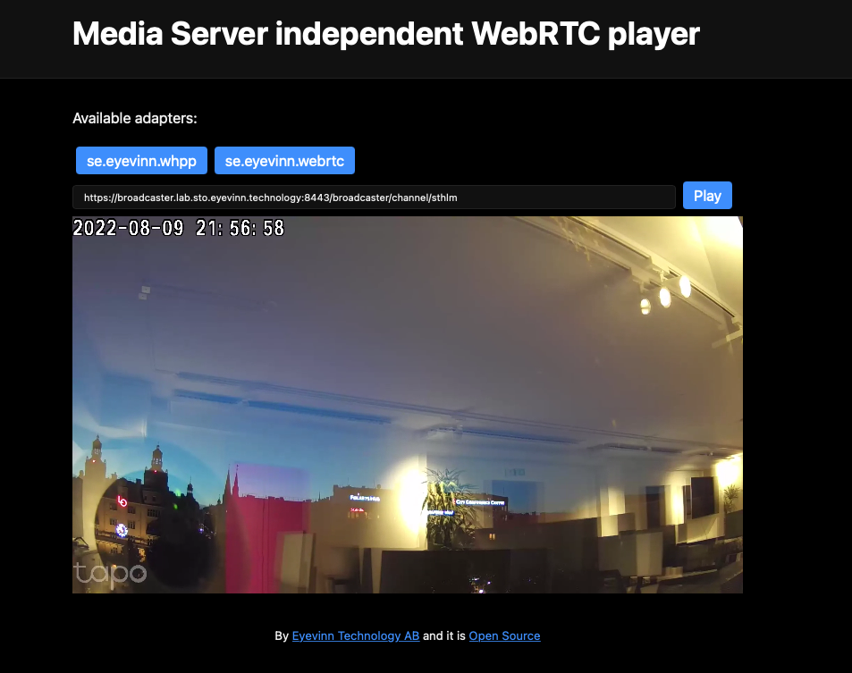

# Media Server independent WebRTC player

As the SDP Offer/Answer exchange is WebRTC media server specific this WebRTC player is designed to be extended with Media Server specific adapters. You can either use one of the included media server adapters or build your own custom adapter.

Contributions are welcome, see below for more information.


## Installation

```
npm install @eyevinn/webrtc-player
```

To run the demo application run:

```
npm run dev
```

To provide a custom list of STUN/TURN servers to use.

```
ICE_SERVERS=turn:<USERNAME>:<SECRET>@turn.eyevinn.technology:3478 npm run dev
```

## Usage

```javascript
  import { WebRTCPlayer } from "@eyevinn/webrtc-player";

  const video = document.querySelector("video");
  const player = new WebRTCPlayer({ video: video, type: "se.eyevinn.whpp" });
  await player.load(new URL(channelUrl));
  player.unmute();
```

## Options

```
{
  video: HTMLVideoElement;
  iceServers: RTCIceServer[]; // ICE server config
  type: string; // type of adapter (see below for a list of included adapters below)
  adapterFactory: AdapterFactoryFunction; // provide a custom adapter factory when adapter type is "custom"
  vmapUrl?: string; // url to endpoint to obtain VMAP XML (ads)
}
```

## Adapters

As SDP exchange is WebRTC media server specific this player includes adapters for various types of WebRTC media servers. 

### `se.eyevinn.whpp`

Compatible with WebRTC media servers that implements the [WebRTC HTTP Playback Protocol](https://github.com/Eyevinn/webrtc-http-playback-protocol).

### `whep`

Compatible with WebRTC media servers that implements the [WebRTC HTTP Egress Protocol](https://www.ietf.org/id/draft-murillo-whep-00.html).

### `se.eyevinn.webrtc`

Compatible with WebRTC media servers in [Eyevinn WHIP](https://github.com/Eyevinn/whip) project. Implements the following SDP exchange protocol:

1. WebRTC player (client) creates an SDP offer.
2. Client awaits ICE candidate selection to be completed.
3. Sends an updated local SDP in a JSON `{ sdp: <localSdp> }` to the server using HTTP POST to the specified `channelUrl`.
4. Server responds with a JSON `{ sdp: <remoteSdp> } ` containing the remote SDP.

### Custom Adapter

To provide a custom adapter, implement the interface `Adapter`.

```javascript
import { WebRTCPlayer, Adapter } from "@eyevinn/webrtc-player";

class CustomAdapter implements Adapter {
  private debug: boolean;
  private localPeer: RTCPeerConnection;
  private channelUrl: URL;

  constructor(peer: RTCPeerConnection, channelUrl: URL) {
    this.debug = false;
    this.localPeer = peer;
    this.channelUrl = channelUrl;
  }

  // Called when debug logs should be enabled
  enableDebug() {
    this.debug = true;
  }

  // Should return the RTCPeerConnection owned by this Adapter
  getPeer() : RTCPeerConnection {
    return this.localPeer;
  }

  // Implement the Adapter signalling here, starting the SDP negotiation flow.
  connect(opts?: AdapterConnectOptions) {
  }
}
```

Then provide a factory function that will create a new instance of your adapter.

```javascript
const video = document.querySelector("video");
const player = new WebRTCPlayer({
  video: video, 
  type: "custom", 
  adapterFactory: (peer: RTCPeerConnection, channelUrl: URL) => {
    return new CustomAdapter(peer, channelUrl);
  }
});

```

## Contribution

We would be super happy for contribution to this project in the form adapters for specific WebRTC media servers and of course bugfixes and improvements. Write an issue with a description together with a Pull Request.

# Support

Join our [community on Slack](http://slack.streamingtech.se) where you can post any questions regarding any of our open source projects. Eyevinn's consulting business can also offer you:

- Further development of this component
- Customization and integration of this component into your platform
- Support and maintenance agreement

Contact [sales@eyevinn.se](mailto:sales@eyevinn.se) if you are interested.

# About Eyevinn Technology

Eyevinn Technology is an independent consultant firm specialized in video and streaming. Independent in a way that we are not commercially tied to any platform or technology vendor.

At Eyevinn, every software developer consultant has a dedicated budget reserved for open source development and contribution to the open source community. This give us room for innovation, team building and personal competence development. And also gives us as a company a way to contribute back to the open source community.

Want to know more about Eyevinn and how it is to work here. Contact us at work@eyevinn.se!
